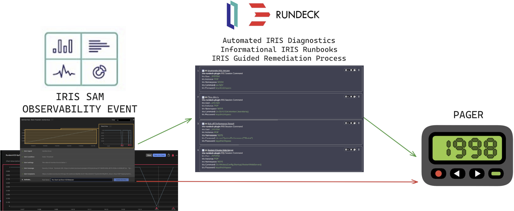
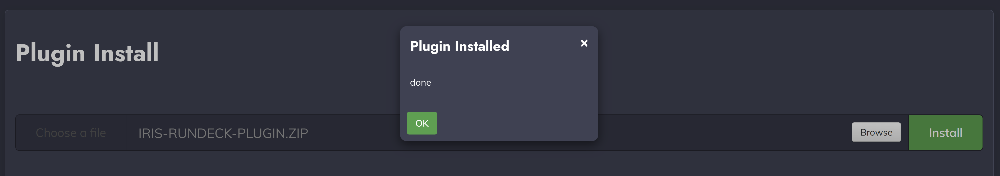
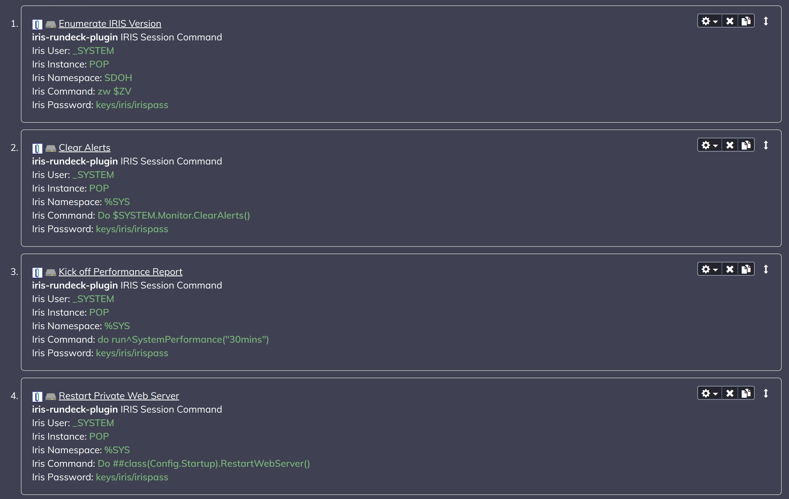

# 

> Rundeck Plugin for Site Reliability Teams Running InterSystems IRIS Workloads

Site Reliability Engineers familiar with Rundeck may find this plugin useful in responding to observability events emitting from InterSystems IRIS workloads.  For those of you new to Site Reliability Engineering in the context of IRIS Workloads, the OSS Rundeck and this plugin can give you an idea on what its going to take to handle observability events before shipping them directly off to pagers for implied support.
# 

##  Rundeck
The way I characterize Rundeck is a "Runbook Firewall" Between the observability event and the Pager.  Situated in between the event and the notification we can do a myriad of things to enrich the validity of, criticality of, and informational gathering to remediate the event or signal.

Runbook types include:  
#### Automated Diagnostics
The ability to invoke a series of actions against IRIS to enumerate either actionable or non-actionable information.

_Scenario:_
We have a number of iris deployments of size small that customers are utilizing, we would like to set an informational detector and grab a sql snapshot of the system when this condition occurs (ex. queue length) for evaluation.

#### Informational Runbook
The ability to share tribal knowledge as to what the alert could be, informational gathering as above, and instructions on remediation, allow to escalate manually to pager duty.

_Scenario:_
On observability event, do interactive tasks, if one thing, pager duty 1, of another pager duty 2

#### Guided Business Process
The ability to inject a decision tree with informational calls and governed actions against resources for first line resolution before development esclation.

_Scenario:_
Disk space filling up. Inject Business process to either remediate or just wait out a customer based condition... ie (Data Load, Non Prod, etc)

## 🚩 Table of Contents

- [Installation](#-installation)
- [Examples](#-examples)
- [Development](#-development)
- [License](#-license)


## 📦 Installation
Download the latest release: [](https://github.com/sween/iris-rundeck-plugin/releases/latest) 

This will make the plugin available in the plugins panel for install.

``` sh
cp build/libs/iris-rundeck-plugin.zip /var/lib/rundeck/libext
```

Or you can upload the plugin directly using the UI.




## 🐾 Examples




### </> Develop

You can see your code reflected as soon as you save the code by running a server. Don't miss adding test cases and then make green rights.

* Using gradle
```
gradle clean build
```

* Using make
```
make clean build
```

## 📜 License

This software is licensed under the [MIT](https://github.com/nhn/tui.editor/blob/master/LICENSE) © [Ron Sweeney, PID^TOO||](https://github.com/sween).
